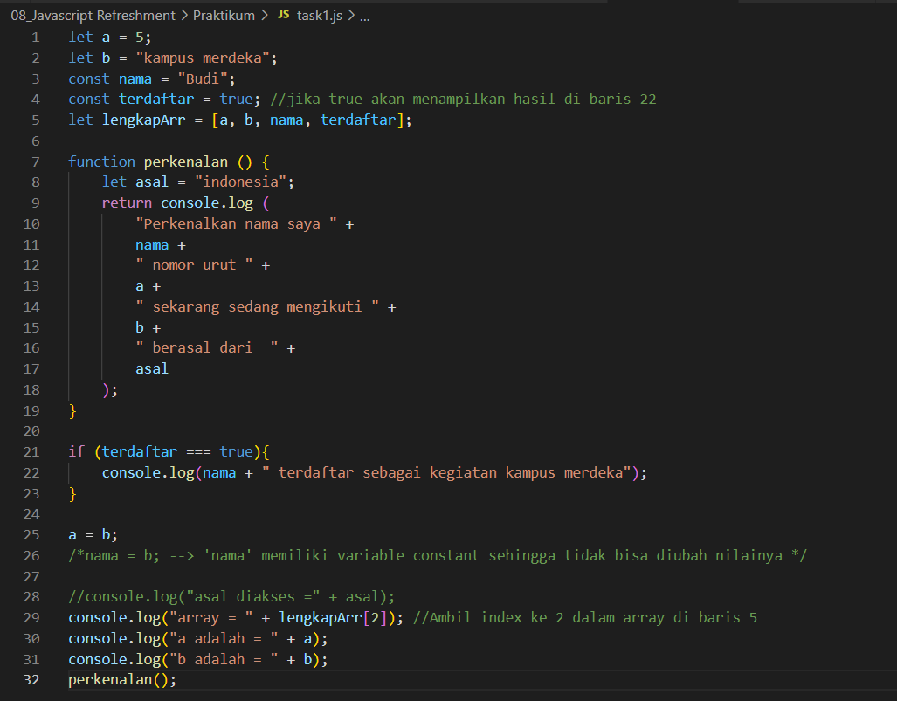

2. Jawablah pertanyaan dibawah sesuai dengan materi yang telah dijelaskan.

    (a) Jelaskan kenapa baris 21, 22, 23 tidak tampil? 
        Jawab : Karena kondisi if yang diminta pada variabel **terdaftar** dibaris 21 adalah bernilai true sedangkan kondisi variabel **terdaftar** yang ada dibaris 4 bernilai false, jadi tidak memenuhi kondisi if.

    (b) Jelaskan kenapa deklarasi pada baris 26 menyebabkan error?
        Jawab : Karena pada variable **nama** memiliki const sehingga variabel tidak bisa diubah seperti baris 26

    (c) Dengan melakukan komen pada baris ke 26, apakah baris 28 dapat dieksekusi? jelaskan
        Jawab : Tidak, karena variabel asal merupakan variabel local sehingga tidak bisa dilakukan pemanggilan diluar scope function tersebut.