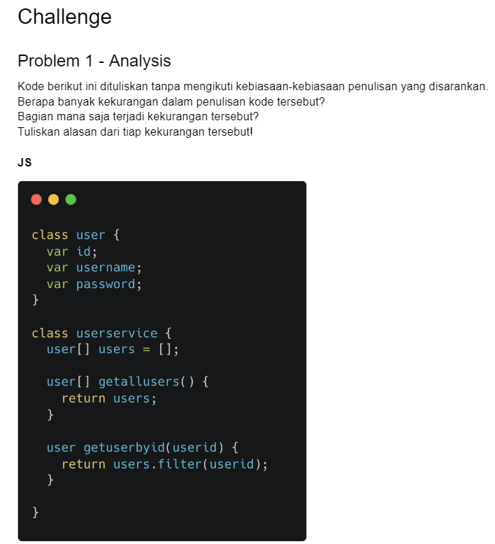
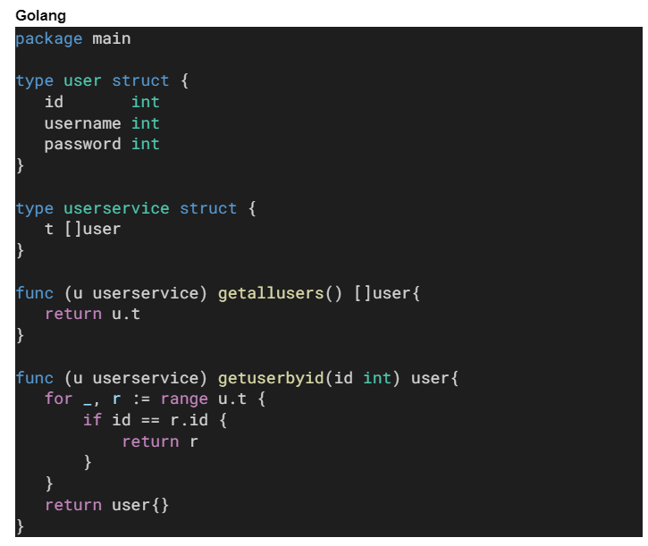

1. Konsisten dalam penulisan seperti class menggunakan PascalCase dan variabel atau function menggunakan camelCase agar terlihat rapih.
2. Penggunaan Variabel lebih baik menggunakan let dan const bukan var untuk menghindari error, karena var menggunaan sistem functional scope dimana dapat diakses dari dalam maupun luar block.
3. Bisa menggunakan komen yang tidak berlebihan dengan maksud menjelaskan code tersebut
4. Menggunakan extend pada userservice
5. Menggunakan constructor pada kedua class