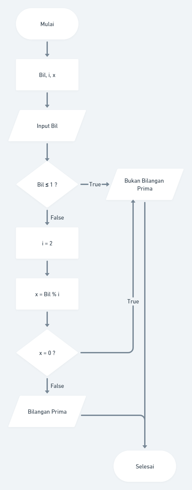

## Problem Problem 1 - Bilangan Prima (max : 50)

 Dalam matematika, bilangan prima adalah bilangan asli yang lebih besar dari angka 1, yang faktor pembaginya adalah 1 dan bilangan itu sendiri. 2 dan 3 adalah bilangan prima. 4 bukan bilangan prima karena 4 bisa dibagi 2. Kamu diminta untuk membuat fungsi untuk menentukan bahwa sebuah bilangan termasuk bilangan prima atau tidak.

#### Buatlah flowchart untuk menentukan bilangan prima menggunakan https://whimsical.com! 

#### Sample Test Cases
Input: 3 
Output: Bilangan Prima**
Input: 7 
Output: Bilangan Prima
Input: 10 
Output: Bukan Bilangan Prima

#### Answer
