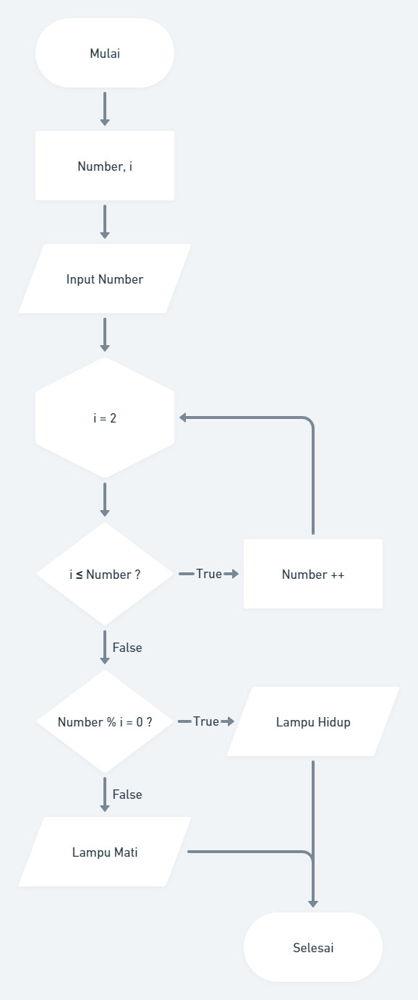

## Problem 2 - Lampu dan Tombol! (max : 50)

Terdapat N tombol yang dinomori dari 1 hingga N dan sebuah lampu dalam keadaan mati. Apabila tombol ke-i ditekan, keadaan lampu akan berubah (dari mati menjadi menyala, atau sebaliknya) jika N habis dibagi oleh i. Apabila masing-masing tombol ditekan tepat sekali, bagaimana keadaan lampu pada akhirnya?

#### Format Masukan 
Sebuah baris berisi sebuah bilangan, yaitu N. 

#### Sebuah baris berisi sebuah bilangan, yaitu N. Format Keluaran Sebuah baris berisi: 
• "lampu mati", apabila keadaan akhir lampu adalah mati. 
• "lampu menyala", apabila keadaan akhir lampu adalah menyala.

#### Buatlah flowchart untuk algoritma tersebut menggunakan https://whimsical.com!

Contoh Masukan : 5 
Contoh Keluaran : lampu mati

Contoh Masukan : 4 
Contoh Keluaran : lampu menyala 

#### Penjelasan

Pada contoh pertama, tombol yang mempengaruhi keadaan lampu adalah tombol 1 dan tombol 5. Penekanan tombol 1 mengakibatkan lampu menjadi menyala, dan penekanan tombol 5 mengembalikannya ke keadaan mati. Pada contoh kedua, tombol yang mempengaruhi keadaan lampu adalah tombol 1, tombol 2, dan tombol 4. Penekanan tombol 1 mengakibatkan lampu menjadi menyala, penekanan tombol 2 mengembalikannya ke keadaan mati, dan penekanan tombol 4 menjadikan lampu kembali menyala.

#### Answer

